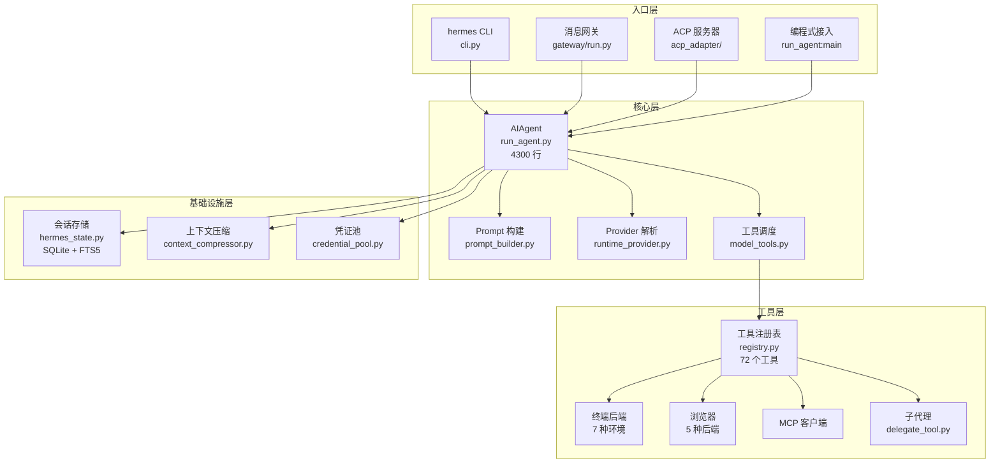

# 00-项目全景

中文 | [English](../en/00-project-overview.md)

> **本章基于 hermes-agent commit [`3bace071b`](https://github.com/NousResearch/hermes-agent/commit/3bace071b)（2026-05-24）**

---

## 概述

Hermes Agent 是 Nous Research 开源的 AI Agent 系统。它的定位用一句话概括：**一个能自我改进、可以在任何地方运行、通过任何渠道交互的 AI 代理**。

这个定位里有三个关键词，每一个都对应了系统架构中的一个核心设计选择：

- **自我改进**：Agent 在完成复杂任务后能自动创建技能（Skill），并在后续使用中优化这些技能。这不是一个静态的工具调用器，而是一个有"记忆"和"成长"能力的系统。
- **任何地方运行**：7 种终端后端（本地、Docker、SSH、Singularity、Modal、Daytona、Vercel Sandbox），从 $5 的 VPS 到 GPU 集群到 serverless 基础设施，都可以是它的执行环境。
- **任何渠道交互**：约 20 个消息平台适配器（Telegram、Discord、Slack、WhatsApp、Signal、微信、飞书、钉钉等），一个 Gateway 进程同时服务多个平台。你可以在电脑前用终端和它对话，也可以掏出手机在 Telegram 上给它发消息。

从代码规模看，这不是一个小项目。截至本次分析的基准 commit，hermes-agent 包含 624 个 Python 源文件（约 44 万行）和 413 个 TypeScript/TSX 文件（约 9 万行）。9363 个 commit，1274 位贡献者——其中 Teknium（Nous Research 创始人）以超过 4600 次 commit 贡献了近半数的变更。项目发布过 15 个版本（v0.2.0 到 v0.14.0），迭代速度很快。

---

## 使用指南

### 安装与第一次对话

安装只需要一行命令：

```bash
curl -fsSL https://raw.githubusercontent.com/NousResearch/hermes-agent/main/scripts/install.sh | bash
```

安装程序会自动处理 uv、Python 3.11、Node.js、ripgrep、ffmpeg 等依赖。装好之后：

```bash
source ~/.bashrc    # 重新加载 shell
hermes              # 开始对话
```

首次启动会引导你选择 LLM Provider 和模型。最快的方式是用 Nous Portal——一条命令搞定所有 API Key：

```bash
hermes setup --portal
```

这会通过 OAuth 登录 Nous Portal，自动配置 Provider、开启 Tool Gateway（Web 搜索、图片生成、TTS、云浏览器），不需要分别收集五六个 API Key。

当然，你也可以用任何 OpenAI 兼容的 Provider。hermes-agent 支持超过 20 种 Provider（以 OpenRouter 为例，一个 Key 访问 300+ 模型）。

### 三种入口

hermes-agent 注册了三个命令行入口（`pyproject.toml:209-212`）：

| 命令 | 入口函数 | 用途 |
|------|---------|------|
| `hermes` | `hermes_cli.main:main` | 交互式 CLI——日常使用的主入口 |
| `hermes-agent` | `run_agent:main` | 编程式接入——从 Python 代码调用 AIAgent |
| `hermes-acp` | `acp_adapter.entry:main` | ACP 服务器——IDE 集成（VS Code、Zed、JetBrains） |

最常用的是 `hermes`，它提供了完整的终端界面：多行编辑、斜杠命令自动补全、对话历史、流式工具输出。典型的使用流程：

```bash
hermes              # 启动交互式 CLI
hermes model        # 切换 LLM Provider 和模型
hermes tools        # 配置工具启用/禁用
hermes gateway      # 启动消息网关（Telegram、Discord 等）
hermes setup        # 运行完整配置向导
hermes doctor       # 诊断问题
```

### 配置

hermes-agent 的配置分为两层：

1. **config.yaml**（`~/.hermes/config.yaml`）——主配置文件，控制模型选择、Provider、工具集、行为偏好等。可以通过 `hermes config set` 修改单项，也可以直接编辑文件。
2. **.env**（`~/.hermes/.env`）——环境变量，主要存储 API Key 等敏感信息。

一个最基本的配置示例：

```yaml
model:
  default: "anthropic/claude-opus-4.6"
  provider: "openrouter"
  base_url: "https://openrouter.ai/api/v1"
```

配置系统的一个值得注意的设计：所有核心依赖都精确锁定版本号（`==X.Y.Z`），不使用版本范围（`pyproject.toml:14-26`）。这个决策源于 2026 年 5 月 12 日的 Mini Shai-Hulud 事件——mistralai 的 2.4.6 版本在 PyPI 上被恶意投毒，如果使用版本范围，所有新安装都会拉到中毒的版本。精确锁定意味着每一次依赖升级都需要有意识的人工审核。

### 常见场景

**场景一：从 Telegram 和它对话。** 在服务器上 `hermes gateway start`，配置好 Telegram Bot Token，然后从手机上给 Bot 发消息。Agent 在服务器上执行工具调用，结果通过 Telegram 返回。跨平台的对话上下文是连续的。

**场景二：自动化定时任务。** 用自然语言描述任务，让 Agent 自己创建 cron 调度：

```
/cron "每天早上 8 点把 Hacker News 前五条总结发到 Telegram"
```

Agent 理解意图后创建定时任务，到点执行并将结果送到指定平台。

**场景三：多模型切换。** 一个对话中途切换模型：

```
/model openrouter:deepseek/deepseek-r1
```

不需要重新配置，不需要改代码。Provider 抽象层处理了格式差异。

### 排错指引

| 问题 | 排查方向 |
|------|---------|
| 启动失败 | `hermes doctor` 会检测 Python 版本、缺失依赖、配置错误 |
| API 调用报错 | 检查 `~/.hermes/agent.log`，确认 API Key 和 Provider 配置 |
| 工具不可用 | `hermes tools` 查看工具启用状态；某些工具需要额外依赖（以 Browser 为例，需要 Playwright） |
| 网关连不上 | `hermes gateway status` 查看进程状态；检查 Bot Token 和网络连通性 |

> 📖 **延伸阅读（官方文档）：**
> - [快速开始](https://hermes-agent.nousresearch.com/docs/getting-started/quickstart)
> - [CLI 使用指南](https://hermes-agent.nousresearch.com/docs/user-guide/cli)
> - [配置参考](https://hermes-agent.nousresearch.com/docs/user-guide/configuration)
> - [架构概览](https://hermes-agent.nousresearch.com/docs/developer-guide/architecture)

---

## 架构与实现

### 从"一条消息的旅程"说起

理解 hermes-agent 的架构，最好的方式是跟踪一条消息从发出到得到回复的完整路径。不管消息来自终端、Telegram 还是 API 调用，它都会经过同一个核心处理流程。差异只在入口和出口。



**图：hermes-agent 系统架构概览**

#### 入口层：四种方式进入同一个 Agent

所有入口最终都创建 `AIAgent` 实例（`run_agent.py`）并调用它的对话循环。入口层的职责是把不同来源的消息翻译成 AIAgent 能理解的格式，然后把 Agent 的回复翻译回去。

- **CLI**（`cli.py`，14785 行）——最重的入口，包含完整的终端 UI：prompt_toolkit 驱动的多行编辑器、斜杠命令解析、流式输出渲染、会话管理。
- **网关**（`gateway/run.py`）——消息平台的统一抽象。一个进程管理多个平台适配器，每个适配器负责一个平台的消息收发。网关为每个用户维护独立的会话。
- **ACP**（`acp_adapter/`）——Agent Communication Protocol 服务器，让 VS Code、Zed、JetBrains 等 IDE 把 hermes-agent 当作代码助手使用。
- **编程式接入**——直接 `from run_agent import AIAgent` 在 Python 中使用。

#### 核心层：AIAgent 的对话循环

`AIAgent`（`run_agent.py`，4309 行）是整个系统的心脏。它的核心是一个循环：

1. **构建 Prompt**（`agent/prompt_builder.py`）——组装系统提示，包含人格设定、工具定义、上下文文件、记忆等多个层级。
2. **选择 Provider**（`hermes_cli/runtime_provider.py`）——根据配置决定用哪个 LLM 后端。支持三种 API 模式：Chat Completions（通用）、Codex Responses（OpenAI Codex 原生）、Anthropic Messages（Anthropic 原生）。
3. **发送请求、处理回复**——调用 LLM，流式接收回复。如果回复包含工具调用，执行工具并把结果送回 LLM，循环直到 LLM 给出最终文本回复。
4. **存储会话**——每轮对话保存到 SQLite 数据库（`hermes_state.py`），支持 FTS5 全文搜索。

这个循环看起来简单，但它要处理的边界情况极多：上下文溢出时自动压缩、Provider 限流时切换凭证、网络断连时重试退避、子代理的生命周期管理、安全审批流程——这些都在后续章节展开。

#### 工具层：72 个工具的注册与调度

hermes-agent 的工具不是硬编码在 Agent 里的。每个工具文件在模块加载时调用 `registry.register()` 自我注册（`tools/registry.py`），声明自己的 schema、处理函数、所属工具集和可用性检查。AIAgent 通过 `model_tools.py` 查询注册表来发现和调度工具。

工具按"工具集"（Toolset）分组。不同平台预设不同的工具集——CLI 平台有完整工具集，Telegram 平台可能禁用某些工具。这套机制让同一个 Agent 在不同场景下有不同的能力边界。

### 代码组织

```
hermes-agent/
├── run_agent.py            — AIAgent 类，核心对话循环（4309 行）
├── cli.py                  — HermesCLI，交互式终端界面（14785 行）
├── model_tools.py          — 工具发现与调度（923 行）
├── toolsets.py             — 工具集定义与平台预设（876 行）
├── hermes_state.py         — SessionDB，SQLite 会话存储 + FTS5（3279 行）
├── hermes_constants.py     — 路径常量，Profile 感知（438 行）
├── batch_runner.py         — 批量轨迹生成（1321 行）
├── mcp_serve.py            — MCP 服务器入口（897 行）
│
├── agent/                  — Agent 内部机制（102 个 .py，Provider 适配、记忆、缓存、压缩等）
├── hermes_cli/             — CLI 子命令、配置向导、插件加载器（97 个 .py）
├── tools/                  — 工具实现（96 个 .py，每个工具一个文件）
│   └── environments/       — 终端后端（local, docker, ssh, modal, daytona, singularity, vercel）
├── gateway/                — 消息网关（61 个 .py）
│   └── platforms/          — 平台适配器（约 20 个平台）
├── plugins/                — 插件系统（122 个 .py，17 个类别）
├── skills/                 — 内置技能（25 个分类）
├── optional-skills/        — 可选技能（17 个分类）
├── acp_adapter/            — ACP 服务器（10 个 .py）
├── tui_gateway/            — TUI 后端（8 个 .py）
├── cron/                   — 定时调度（3 个 .py）
├── ui-tui/                 — Ink (React) 终端 UI
├── web/                    — Web 仪表盘
├── website/                — Docusaurus 文档站
└── tests/                  — 测试套件（1215 个文件，约 44.6 万行）
```

两个"巨型文件"值得特别注意：`cli.py`（14785 行）和 `run_agent.py`（4309 行）。在大多数项目中，这样的文件规模会被视为技术债务。但 hermes-agent 有意为之——`cli.py` 把所有终端交互逻辑集中在一个文件中，避免了跨文件的状态共享问题；`run_agent.py` 把整个 Agent 循环控制在一个类中，让调试和追踪变得简单。这是一种"上帝文件"取向的架构选择，牺牲了模块化换取了执行路径的可追踪性。

### 设计决策

#### 决策一：OpenAI 兼容作为公约数

hermes-agent 不为每个 Provider 写独立的 SDK 集成。它选择了一个务实的策略：绝大多数 LLM Provider 都提供 OpenAI 兼容的 API，那就用 `openai` Python SDK 作为唯一的 HTTP 客户端，通过切换 `base_url` 和 API Key 来切换 Provider。

这个选择的代价是：某些 Provider 的原生特性（以 Anthropic 的 Prompt Caching 为例）无法通过 OpenAI 兼容接口使用，需要专门的适配器（`agent/anthropic_adapter.py`）。但收益是巨大的：新增一个 Provider 的成本接近于零——只要它兼容 OpenAI API，在 `cli-config.yaml` 里加几行配置就够了。

#### 决策二：懒加载依赖

核心依赖列表刻意保持最小（`pyproject.toml:12-66`，只有 12 个包），所有 Provider 特定的依赖（`anthropic`、`firecrawl-py`、`fal-client` 等）都通过 `tools/lazy_deps.py` 在用户首次选择该后端时才安装。这个设计的动机在 Mini Shai-Hulud 事件后更加清晰：依赖越少，供应链攻击的爆炸半径越小。

#### 决策三：Profile 隔离

hermes-agent 支持多 Profile（`~/.hermes/profiles/<name>/`），每个 Profile 有独立的配置、记忆、技能和会话数据。`hermes_constants.py` 中的 `get_hermes_home()` 函数是所有路径解析的唯一来源（`hermes_constants.py:43`），通过 `HERMES_HOME` 环境变量或 `active_profile` 文件来切换 Profile。

这不仅是多用户场景的需要。在 Docker 部署中，Profile 目录映射到持久卷，容器销毁后数据不丢失。在子代理场景中，每个子代理可以有独立的 Profile 以避免状态污染。

### 扩展点

hermes-agent 提供了多个正式的扩展点——不需要修改源码就可以增加功能：

1. **插件系统**（`plugins/`）——17 个类别的插件，覆盖记忆 Provider、上下文引擎、模型 Provider、图像生成、观测性等。详见第 06-09 章。
2. **技能系统**（`skills/`、`optional-skills/`）——Agent 可以在使用中自动创建和改进技能，也可以从 Skills Hub（agentskills.io）安装社区技能。详见第 03 章。
3. **工具注册**（`tools/registry.py`）——新增工具只需创建一个 .py 文件并调用 `registry.register()`。详见第 03 章。
4. **平台适配器**（`gateway/platforms/`）——新增消息平台只需实现 `BasePlatformAdapter` 接口。详见第 04 章。
5. **终端后端**（`tools/environments/`）——新增执行环境只需实现 `BaseEnvironment` 接口。详见第 03 章。
6. **MCP 服务器**——通过配置接入任何 MCP 服务器，扩展 Agent 的工具能力。

---

## 与其他章节的关系

本章是全景式的导览，后续章节会深入每个子系统：

| 章节 | 深入哪个子系统 |
|------|--------------|
| 01 — 基础设施层 | hermes_cli 的完整内部机制 |
| 02 — Agent 核心 | AIAgent 的对话循环、Provider 适配、上下文管理 |
| 03 — 工具系统 | 工具注册、发现、调度、安全防线、终端后端 |
| 04 — 网关层 | Gateway 架构、平台适配器模式、会话管理 |
| 05 — 协议适配层 | ACP、MCP 的集成实现 |
| 06 — 插件框架 | PluginContext API、钩子系统、加载规则 |
| 07 — 模型层插件 | Provider 插件、图像/视频生成插件 |
| 08 — 运行时增强插件 | 记忆、上下文引擎、观测性、Kanban 插件 |
| 09 — 外部集成插件 | Spotify、Google Meet、Teams 等集成 |
| 10 — Kanban 系统 | 多 Agent 协作的看板调度 |
| 11 — 交互界面与运行模式 | TUI、Web 仪表盘、语音模式 |
| 12 — 批量运行与调度 | Batch Runner、Cron、RL 训练数据生成 |
| 13 — 工程实践 | 测试、安全、日志、部署 |
