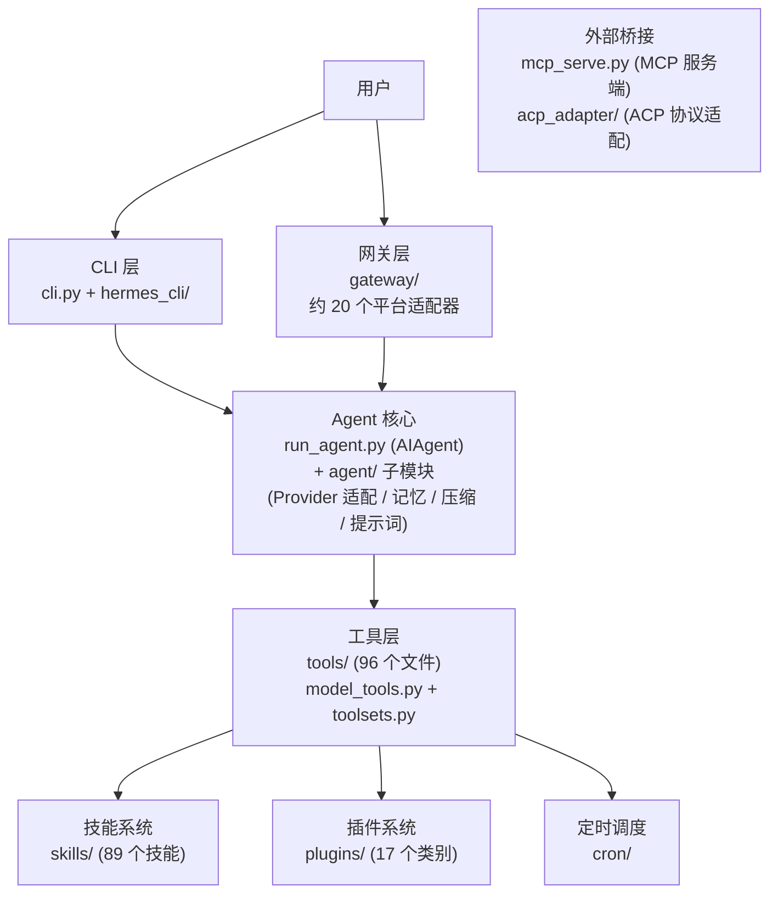
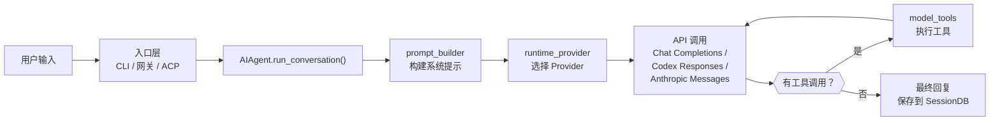

# 00-项目全景：一个试图自我进化的 AI 智能体

中文 | [English](../en/00-project-overview.md)

> **本章基于 hermes-agent commit [`3bace071b`](https://github.com/NousResearch/hermes-agent/commit/3bace071b)（2026-05-24）**

---

## 它想解决什么问题？

如果你想让一个 AI agent 不只是"接收指令 → 执行 → 返回结果"的一次性工具，而是一个能从经验中学习、跨会话记住你是谁、甚至在你不在的时候自动工作的长期伙伴——你会怎么设计它？

Nous Research 的回答是 Hermes Agent。这是一个 MIT 开源的 AI 智能体框架（当前 v0.14.0，`pyproject.toml:7`），它的野心写在一行描述里：

> "The self-improving AI agent — creates skills from experience, improves them during use, and runs anywhere."
>
> — `pyproject.toml:8`

三个关键词：**自改进**、**技能学习**、**随处运行**。但这些说法太抽象了。在深入细节之前，先建立一个全景认知。

---

## 使用指南

### 安装与第一次对话

安装只需要一行命令：

```bash
curl -fsSL https://raw.githubusercontent.com/NousResearch/hermes-agent/main/scripts/install.sh | bash
```

安装程序会自动处理 uv、Python 3.11、Node.js、ripgrep、ffmpeg 等依赖。装好之后：

```bash
source ~/.bashrc    # 重新加载 shell
hermes              # 开始对话
```

首次启动会引导你选择 LLM Provider 和模型。最快的方式是用 Nous Portal——一条命令搞定所有 API Key：

```bash
hermes setup --portal
```

这会通过 OAuth 登录 Nous Portal，自动配置 Provider、开启 Tool Gateway（Web 搜索、图片生成、TTS、云浏览器），不需要分别收集五六个 API Key。

当然，你也可以用任何 OpenAI 兼容的 Provider。hermes-agent 支持超过 20 种 Provider（以 OpenRouter 为例，一个 Key 访问 300+ 模型）。

### 三种入口，同一个 Agent

Hermes 有三个主要入口点（`pyproject.toml:209-212`），但它们最终都调用同一个核心——`AIAgent.run_conversation()`：

**`hermes` 命令**（`hermes_cli.main:main`）是日常使用的入口。它是一个功能完整的 CLI，包含 chat、gateway、setup、cron、model 等子命令。输入 `hermes` 不带参数就进入交互式对话。

```bash
hermes              # 启动交互式 CLI
hermes model        # 切换 LLM Provider 和模型
hermes tools        # 配置工具启用/禁用
hermes gateway      # 启动消息网关（Telegram、Discord 等）
hermes setup        # 运行完整配置向导
hermes doctor       # 诊断问题
```

**`hermes-agent` 命令**（`run_agent:main`）是面向开发者和脚本的入口。它直接暴露 `AIAgent` 类，可以在代码里 `from run_agent import AIAgent` 来嵌入使用。

**`hermes-acp` 命令**（`acp_adapter.entry:main`）是 ACP 服务器入口——让 VS Code、Zed、JetBrains 等 IDE 把 hermes-agent 当作代码助手使用。

### 配置

Hermes 的配置遵循一个清晰的优先级链：

**CLI flag > 环境变量 > yaml 配置文件 > 内置默认值**

这意味着你可以在 `config.yaml`（`~/.hermes/config.yaml`）里设好日常配置，用 `.env` 文件覆盖敏感信息（API Key），用命令行参数做临时调整——三层互不干扰。

一个最基本的配置示例：

```yaml
model:
  default: "anthropic/claude-opus-4.6"
  provider: "openrouter"
  base_url: "https://openrouter.ai/api/v1"
```

配置文件本身（`cli-config.yaml.example`，约 1100 行）覆盖面极广：从模型选择、终端后端、安全策略、上下文压缩参数、记忆行为、显示主题到 MCP 服务器接入，几乎每个行为都可以调。但核心设计原则是**零配置可用**——默认值经过精心选择，拿到 API Key 就能跑。

### 常见场景

**场景一：从 Telegram 和它对话。** 在服务器上 `hermes gateway start`，配置好 Telegram Bot Token，然后从手机上给 Bot 发消息。Agent 在服务器上执行工具调用，结果通过 Telegram 返回。跨平台的对话上下文是连续的。

**场景二：自动化定时任务。** 用自然语言描述任务，让 Agent 自己创建 cron 调度：

```
/cron "每天早上 8 点把 Hacker News 前五条总结发到 Telegram"
```

Agent 理解意图后创建定时任务，到点执行并将结果送到指定平台。

**场景三：多模型切换。** 一个对话中途切换模型：

```
/model openrouter:deepseek/deepseek-r1
```

不需要重新配置，不需要改代码。Provider 抽象层处理了格式差异。

### 排错指引

| 问题 | 排查方向 |
|------|---------|
| 启动失败 | `hermes doctor` 会检测 Python 版本、缺失依赖、配置错误 |
| API 调用报错 | 检查 `~/.hermes/agent.log`，确认 API Key 和 Provider 配置 |
| 工具不可用 | `hermes tools` 查看工具启用状态；某些工具需要额外依赖（以 Browser 为例，需要 Playwright） |
| 网关连不上 | `hermes gateway status` 查看进程状态；检查 Bot Token 和网络连通性 |

> 📖 **延伸阅读（官方文档）：**
> - [快速开始](https://hermes-agent.nousresearch.com/docs/getting-started/quickstart)
> - [CLI 使用指南](https://hermes-agent.nousresearch.com/docs/user-guide/cli)
> - [配置参考](https://hermes-agent.nousresearch.com/docs/user-guide/configuration)
> - [架构概览](https://hermes-agent.nousresearch.com/docs/developer-guide/architecture)

---

## 架构与实现

### 模块全景

Hermes 的代码库可以分为六个大区域。下面这张图展示了它们之间的关系——箭头表示"依赖"或"调用"：



**图：Hermes 六大模块的依赖调用关系**

各模块一句话说明：

- **CLI 层** (`cli.py` + `hermes_cli/`) — 你在终端里看到的一切：交互式 REPL、子命令（chat/gateway/setup/cron/model）、TUI 界面。它是用户和 Agent 之间的桥梁。
- **网关层** (`gateway/`) — 让同一个 Agent 同时服务 Telegram、Discord、Slack、WhatsApp 等约 20 个平台的统一消息入口。一个进程，所有平台。
- **Agent 核心** (`run_agent.py` + `agent/`) — 整个系统的心脏。`AIAgent` 类实现了"接收消息 → 调用模型 → 解析工具调用 → 执行工具 → 循环直到完成"的核心循环。`agent/` 子目录处理 Provider 适配、上下文压缩、提示词构建、记忆管理等支撑逻辑。
- **工具层** (`tools/` + `model_tools.py`) — Agent 的"手脚"。96 个工具文件覆盖终端执行、文件操作、Web 搜索、浏览器自动化、语音、图像生成等能力。`model_tools.py` 负责工具注册和调度。
- **技能与插件** (`skills/` + `plugins/`) — Agent 的"长期记忆和学习能力"。技能是可复用的任务模板（89 个内置 + 81 个可选），插件扩展记忆、上下文引擎、模型 Provider 等能力。
- **外部桥接** (`mcp_serve.py` + `acp_adapter/`) — 让其他系统（Claude Code、Cursor 等）通过标准协议调用 Hermes 的能力。

这些模块的依赖关系是**严格单向的**：CLI/网关 → Agent 核心 → 工具层。没有反向依赖。需要反向调用的地方（以子代理工具为例，它需要创建新的 AIAgent），都用延迟导入（在函数内部而非文件顶部引入依赖）来避免循环导入问题。

### 五个核心问题

理解了全景之后，我们来看 Hermes 为什么要这样组织——它面临的几个核心问题决定了整个架构。

#### 问题一：模型锁定

大多数 AI agent 框架绑死在一个模型提供商上——用 OpenAI 的就只能用 GPT，用 Anthropic 的就只能用 Claude。但模型市场变化极快，今天最好的模型明天可能被超越，或者价格突然翻倍。

Hermes 的选择是**完全不锁定模型**。它的配置文件（`cli-config.yaml.example:13-43`）列出了超过 20 种 Provider：OpenRouter（300+ 模型）、Anthropic、OpenAI、Nous Portal、Gemini、NVIDIA NIM、小米 MiMo、Kimi、MiniMax、Hugging Face、Arcee、Ollama Cloud、KiloCode……甚至支持本地运行的 Ollama、LM Studio、vLLM、llama.cpp。用户可以随时用 `hermes model` 切换，不需要改代码。

这个选择带来了一个架构后果：Hermes 必须在代码里处理各家 API 的差异——Anthropic 的消息格式和 OpenAI 的不一样，Bedrock 又有自己的协议。这就是后面会看到的 Provider 适配层存在的原因。它的解决方案是务实的：绝大多数 Provider 都提供 OpenAI 兼容的 API，那就用 `openai` Python SDK 作为唯一的 HTTP 客户端，通过切换 `base_url` 和 API Key 来切换 Provider。某些 Provider 的原生特性（以 Anthropic 的 Prompt Caching 为例）无法通过兼容接口使用，则用专门的适配器处理（`agent/anthropic_adapter.py`）。

#### 问题二：平台碎片化

你可能在 Mac 终端里和 AI 对话，但你的用户可能在 Telegram 上。你的团队可能用 Slack。你的客户可能用 WhatsApp。如果每个平台写一套独立的 agent，维护成本是线性增长的。

Hermes 的做法是搭了一个**统一网关**（`gateway/`）：一个进程同时连接所有平台，共享同一套 agent 逻辑。Telegram 来一条消息和 CLI 打一行字，最终都走到同一个 `AIAgent.run_conversation()` 方法。网关层目前支持约 20 个平台（`gateway/platforms/`）：Telegram、Discord、Slack、WhatsApp、Signal、飞书、钉钉、企业微信、微信、Matrix、Mattermost、Email、SMS、Home Assistant、BlueBubbles、腾讯元宝、QQ Bot 等。

#### 问题三：一次性对话的局限

传统 chatbot 的会话是一次性的——关掉窗口，所有上下文就消失了。下次你再来，它不知道你上周让它做了什么，也不记得你偏好什么工作方式。

Hermes 试图打破这个限制，做了三件事：
- **持久记忆**：agent 会主动将重要信息写入 `MEMORY.md` 和 `USER.md`，下次会话时自动加载（`agent/memory_manager.py`）
- **会话搜索**：历史对话存入 SQLite 并建了 FTS5 全文索引，agent 可以搜索自己的过去（`hermes_state.py`）
- **技能学习**：完成一个复杂任务后，agent 会把解决方案抽象成"技能"保存下来，下次遇到类似问题直接调用（`tools/skill_manager_tool.py`）

这不是简单的"把聊天记录存起来"。它更像是在模拟一种工作记忆 + 长期记忆的分层结构，试图让 agent 随着使用而变得更懂你。

#### 问题四：对话越来越长

AI 模型有上下文窗口限制——即使是 100 万 token 的窗口，一个长时间运行的 agent 也终会撞到天花板。而且上下文越长，API 费用越高、延迟越大。

Hermes 的应对方案是一个**上下文压缩器**（`agent/context_compressor.py`）。当对话历史占满上下文窗口的一定比例时，它会用一个廉价的辅助模型把中间的对话摘要化，只保留头部（保持系统提示稳定）和尾部（保持最近上下文）。这不是简单截断——它是让 LLM 把中间对话压缩成摘要——像把一本书压缩成复习提纲，丢弃细节但保留关键信息。摘要预算按压缩内容量的 20% 分配（`_SUMMARY_RATIO = 0.20`，`context_compressor.py:57`），下限 2000 token，上限 12000 token。

#### 问题五：Agent 不应该只待在你的笔记本上

很多 agent 框架假设你会在本地终端里使用它们。但如果你想让 agent 在云上 7×24 运行、定期执行任务、在你睡觉的时候帮你监控某个东西呢？

Hermes 提供了七种"终端后端"（`tools/environments/`）：本地执行、Docker 容器、SSH 远程机器、Daytona 云沙箱、Singularity HPC 容器、Modal Serverless、Vercel Sandbox。后几者支持"休眠"：agent 的执行环境在空闲时自动暂停，有任务时再唤醒，几乎零成本。

配合内置的 cron 调度器（`cron/`），你可以用自然语言设置定时任务："每天早上 8 点把昨天的 GitHub issue 汇总发到 Telegram 群里"——agent 会在指定时间醒来、执行、投递结果、然后继续休眠。

### 项目结构：循着问题找代码

如果你把 Hermes 的目录结构和上面五个问题对应起来，会发现它的组织逻辑很清楚：

**"怎么和模型对话？"** → `run_agent.py`（AIAgent 类，工具调用循环）+ `agent/`（Provider 适配、提示词构建、上下文压缩、记忆管理）

**"怎么和用户对话？"** → `cli.py`（终端 TUI）+ `gateway/`（多平台网关）+ `hermes_cli/`（CLI 子命令）

**"怎么做事？"** → `tools/`（96 个工具文件，覆盖终端执行、文件操作、Web 搜索、浏览器自动化等）+ `model_tools.py`（工具注册和调度）

**"怎么学习？"** → `skills/`（89 个内置技能）+ `optional-skills/`（81 个可选技能）+ `plugins/`（记忆和上下文插件）

**"怎么独立运行？"** → `cron/`（定时调度）+ `tools/environments/`（7 种终端后端）+ `Dockerfile`（容器化）

**"怎么被其他系统调用？"** → `mcp_serve.py`（MCP 服务端）+ `acp_adapter/`（ACP 协议适配，IDE 集成）

**"怎么用于研究？"** → `batch_runner.py`（批量轨迹生成）+ `trajectory_compressor.py`（轨迹压缩）

还有一些胶水：`hermes_constants.py` 定义共享常量（`get_hermes_home()` 返回 `~/.hermes`，`hermes_constants.py:43`）；`hermes_state.py` 管理 SQLite 会话存储和 FTS5 全文搜索；`toolsets.py` 把工具组织成"工具集"供不同平台启用/禁用。

### 核心数据流

不管消息来自终端、Telegram 还是 API 调用，它都会经过同一个核心处理流程：



**图：一条消息从输入到回复的完整路径**

这个循环看起来简单，但它要处理的边界情况极多：上下文溢出时自动压缩、Provider 限流时切换凭证、网络断连时重试退避、子代理的生命周期管理、安全审批流程——这些都在后续章节展开。

### 设计决策

#### 决策一：懒加载依赖

核心依赖列表刻意保持最小（`pyproject.toml:12-66`，只有 12 个包），所有 Provider 特定的依赖（`anthropic`、`firecrawl-py`、`fal-client` 等）都通过 `tools/lazy_deps.py` 在用户首次选择该后端时才安装。

这个设计的动机在 2026 年 5 月 12 日的 Mini Shai-Hulud 事件后更加清晰：mistralai 的 2.4.6 版本在 PyPI 上被恶意投毒。如果使用版本范围（`>=2.3.0,<3`），所有新安装都会拉到中毒的版本。hermes-agent 因此做了两个决定（`pyproject.toml:14-26`）：
1. **精确锁定版本号**（`==X.Y.Z`），不使用范围——每一次依赖升级都需要有意识的人工审核
2. **从 `[all]` extra 中移除所有可懒加载的依赖**（`pyproject.toml:174-207`）——减小爆炸半径

#### 决策二：两个"上帝文件"

`cli.py`（14785 行）和 `run_agent.py`（4309 行）是 Hermes 的两个巨型文件。在大多数项目中，这样的文件规模会被视为技术债务。但 Hermes 有意为之——`cli.py` 把所有终端交互逻辑集中在一个文件中，避免了跨文件的状态共享问题；`run_agent.py` 把整个 Agent 循环控制在一个类中，让调试和追踪变得简单。这是一种"上帝文件"取向的架构选择，牺牲了模块化换取了执行路径的可追踪性。

#### 决策三：Profile 隔离

hermes-agent 支持多 Profile（`~/.hermes/profiles/<name>/`），每个 Profile 有独立的配置、记忆、技能和会话数据。`hermes_constants.py` 中的 `get_hermes_home()` 函数是所有路径解析的唯一来源（`hermes_constants.py:43`），通过 `HERMES_HOME` 环境变量或 `active_profile` 文件来切换 Profile。

这不仅是多用户场景的需要。在 Docker 部署中，Profile 目录映射到持久卷，容器销毁后数据不丢失。在子代理场景中，每个子代理可以有独立的 Profile 以避免状态污染。`get_hermes_home()` 甚至会在检测到非默认 Profile 激活但 `HERMES_HOME` 未设置时输出一条警告（`hermes_constants.py:79-99`），防止跨 Profile 数据写入错误位置。

### 扩展点

hermes-agent 提供了多个正式的扩展点——不需要修改源码就可以增加功能：

1. **插件系统**（`plugins/`）——17 个类别的插件，覆盖记忆 Provider、上下文引擎、模型 Provider、图像/视频生成、观测性、Kanban 等。详见第 06-09 章。
2. **技能系统**（`skills/`、`optional-skills/`）——Agent 可以在使用中自动创建和改进技能，也可以从 Skills Hub（agentskills.io）安装社区技能。详见第 03 章。
3. **工具注册**（`tools/registry.py`）——新增工具只需创建一个 .py 文件并调用 `registry.register()`，声明 schema、处理函数和所属工具集。详见第 03 章。
4. **平台适配器**（`gateway/platforms/`）——新增消息平台只需实现 `BasePlatformAdapter` 接口。详见第 04 章。
5. **终端后端**（`tools/environments/`）——新增执行环境只需实现 `BaseEnvironment` 接口。详见第 03 章。
6. **MCP 服务器**——通过配置接入任何 MCP 服务器，扩展 Agent 的工具能力。

---

## 这些代码是人写的吗？

看完上面的内容，一个自然的问题浮现出来：44 万行 Python，9363 次提交——这些代码有多少是人写的，多少是 AI 生成的？

### 证据

**提交速度异常。** 项目始于 2025 年 7 月，但真正爆发是 2026 年 3 月（2514 次提交）和 4 月（4008 次提交）。主要贡献者 Teknium（4690 次提交，占总量的 50%）在 2026 年 3 月平均每天 60 次提交，峰值达到单日 199 次（2026-03-14）。这个速度对于纯人工编码来说几乎不可能——即使是全职开发者，每天 5-10 次有意义的提交已经是高产。

**显式的 AI 共创标记。** git 历史中有 246 次提交带有 Claude 的 Co-Authored-By 标记（包括 Claude Opus 4.6、Sonnet 4.6 等），另有 23 次标记 Hermes Agent 自身为共同作者——意味着 Hermes 参与了自身的开发。但这些显式标记只占总提交的 ~3%，远低于实际 AI 参与度。

**代码特征。** `run_agent.py`（4309 行）和 `cli.py`（14785 行）注释风格详尽而规整——"每个分支都有解释性注释"的模式是 AI 辅助编码的典型特征。人类程序员通常只在复杂逻辑处加注释，而 AI 倾向于对每个代码块都生成说明。

**项目自带 AI 编码指南。** `AGENTS.md`（1132 行）是专门为 AI 编码助手写的开发指南，详细说明了项目结构、测试方法、代码规范。这表明 AI 编码工具是项目开发流程的正式组成部分。

### 结论

**这是一个典型的 AI 深度辅助开发产物。** 架构设计和核心决策是人做的，大量实现代码是 AI 生成、人工审核的。一个"自改进的 AI agent"项目用 AI 来开发自己——这不是偷懒，而是 dogfooding。

---

## 项目统计

### 代码规模

| 指标 | 数量 |
|------|------|
| Python 源文件（不含测试） | 624 个 |
| Python 源代码行数 | ~443,000 行 |
| TS/TSX 文件 | 413 个（~91,000 行） |
| 测试文件 | 1,215 个（~446,000 行） |

### 模块规模（Python 行数，按重心排序）

| 模块 | 文件数 | 行数 | 说明 |
|------|--------|------|------|
| `hermes_cli/` | 97 | 100,759 | 最大模块——CLI 子命令、配置向导、插件加载器 |
| `gateway/` | 61 | 80,025 | 约 20 个平台适配器的代码量 |
| `tools/` | 96 | 68,250 | 72 个注册工具的实现 |
| `agent/` | 102 | 63,679 | Agent 核心支撑模块 |
| `plugins/` | 122 | 46,477 | 17 个类别的可选插件 |
| `cli.py` | 1 | 14,785 | 单文件——交互式终端 REPL |
| `tui_gateway/` | 8 | 7,681 | TUI 网关桥接 |
| `acp_adapter/` | 10 | 5,021 | ACP 协议适配 |
| `run_agent.py` | 1 | 4,309 | 单文件——AIAgent 类，整个系统的核心循环 |
| `cron/` | 3 | 3,217 | 定时调度 |

### 生态规模

| 指标 | 数量 |
|------|------|
| 支持的模型 Provider | 20+ |
| 支持的消息平台 | 约 20 个（`gateway/platforms/`） |
| 注册工具 | 72 个 |
| 内置技能 | 89 个 |
| 可选技能 | 81 个 |
| 技能分类 | 25 个内置 + 17 个可选 |
| 终端后端 | 7 种 |
| 核心 PyPI 依赖 | 12 个（精确锁定） |
| 可选 extras | 20+ 个 |
| 配置文件 | ~1,100 行可调参数 |
| Git 提交 | 9,363 次 |
| 贡献者 | 1,274 位 |

---

## 附录：代码库完整文件索引

`hermes-agent/` 顶层的每个文件和目录：

### 核心代码

| 路径 | 行数 | 说明 |
|------|------|------|
| `run_agent.py` | 4,309 | AIAgent 类——核心对话循环（→ 第 02 章） |
| `cli.py` | 14,785 | 交互式终端 TUI（→ 第 11 章） |
| `model_tools.py` | 923 | 工具发现与调度入口（→ 第 03 章） |
| `toolsets.py` | 876 | 工具集定义和平台映射（→ 第 03 章） |
| `toolset_distributions.py` | 364 | 数据生成用工具集概率分布（→ 第 12 章） |
| `mcp_serve.py` | 897 | MCP 服务端，暴露消息网关能力（→ 第 05 章） |
| `hermes_constants.py` | 438 | 共享常量（HERMES_HOME、Profile 路径等） |
| `hermes_state.py` | 3,279 | SQLite 会话存储 + FTS5 全文搜索（→ 第 13 章） |
| `hermes_logging.py` | 389 | 三路日志分发（→ 第 13 章） |
| `hermes_time.py` | 104 | 时间工具函数 |
| `hermes_bootstrap.py` | 129 | Windows UTF-8 stdio 引导 |
| `utils.py` | 361 | 原子写入等通用工具 |
| `batch_runner.py` | 1,321 | 批量轨迹生成（→ 第 12 章） |
| `trajectory_compressor.py` | 1,508 | 轨迹压缩（→ 第 12 章） |

### 核心目录

| 路径 | 文件数 | 行数 | 说明 |
|------|--------|------|------|
| `agent/` | 102 | 63,679 | Agent 支撑：Provider 适配、上下文压缩、记忆、提示词（→ 第 02 章） |
| `tools/` | 96 | 68,250 | 工具实现 + 安全审批（→ 第 03 章） |
| `gateway/` | 61 | 80,025 | 消息网关 + 平台适配器（→ 第 04 章） |
| `hermes_cli/` | 97 | 100,759 | CLI 子命令 + 配置向导 + 插件管理器（→ 第 01 章） |
| `plugins/` | 122 | 46,477 | 17 类插件：记忆 / 图像生成 / 观测性 / Kanban 等（→ 第 06-09 章） |
| `skills/` | 570 files | — | 89 个内置技能（25 个分类）（→ 第 03 章） |
| `optional-skills/` | 285 files | — | 81 个可选技能（17 个分类）（→ 第 03 章） |
| `cron/` | 3 | 3,217 | 定时调度系统（→ 第 12 章） |
| `acp_adapter/` | 10 | 5,021 | ACP 编辑器协议适配（→ 第 05 章） |
| `tui_gateway/` | 8 | 7,681 | Ink TUI 与 Python Agent 的 JSON-RPC 桥接（→ 第 11 章） |
| `tests/` | 1,215 | ~446,000 | 测试套件（→ 第 13 章） |

### 前端和 UI

| 路径 | 说明 |
|------|------|
| `ui-tui/` | React/Ink 终端 UI（Node.js，→ 第 11 章） |
| `web/` | Web Dashboard 前端 SPA（React/Vite，→ 第 11 章） |

### 研究和数据生成

| 路径 | 行数 | 说明 |
|------|------|------|
| `batch_runner.py` | 1,321 | 批量轨迹生成（→ 第 12 章） |
| `trajectory_compressor.py` | 1,508 | 轨迹压缩（→ 第 12 章） |
| `datagen-config-examples/` | — | 数据生成配置模板 |

### 部署和打包

| 路径 | 说明 |
|------|------|
| `Dockerfile` | Docker 多阶段构建 |
| `docker-compose.yml` | gateway + dashboard 双服务 |
| `setup-hermes.sh` | 一键安装脚本 |
| `flake.nix` + `nix/` | Nix flake 打包 |
| `packaging/` | Homebrew formula |
| `pyproject.toml` | Python 项目元数据和依赖 |
| `package.json` | Node.js 依赖 |

### 文档和元数据

| 路径 | 说明 |
|------|------|
| `README.md` | 项目 README |
| `AGENTS.md` | AI 编码助手开发指南（1,132 行） |
| `CONTRIBUTING.md` | 贡献指南 |
| `SECURITY.md` | 安全政策 |
| `RELEASE_v*.md` | 各版本 release notes（v0.2.0 到 v0.14.0） |
| `website/` | Docusaurus 文档站 |

---

## 与其他章节的关系

本章是全景式的导览，后续章节会深入每个子系统：

| 章节 | 深入哪个子系统 |
|------|--------------|
| 01 — 基础设施层 | hermes_cli 的完整内部机制 |
| 02 — Agent 核心 | AIAgent 的对话循环、Provider 适配、上下文管理 |
| 03 — 工具系统 | 工具注册、发现、调度、安全防线、终端后端 |
| 04 — 网关层 | Gateway 架构、平台适配器模式、会话管理 |
| 05 — 协议适配层 | ACP、MCP 的集成实现 |
| 06 — 插件框架 | PluginContext API、钩子系统、加载规则 |
| 07 — 模型层插件 | Provider 插件、图像/视频生成插件 |
| 08 — 运行时增强插件 | 记忆、上下文引擎、观测性、Kanban 插件 |
| 09 — 外部集成插件 | Spotify、Google Meet、Teams 等集成 |
| 10 — Kanban 系统 | 多 Agent 协作的看板调度 |
| 11 — 交互界面与运行模式 | TUI、Web 仪表盘、语音模式 |
| 12 — 批量运行与调度 | Batch Runner、Cron、RL 训练数据生成 |
| 13 — 工程实践 | 测试、安全、日志、部署 |

---

*本文基于 hermes-agent v0.14.0 源码分析。所有代码引用均经过独立验证。*
