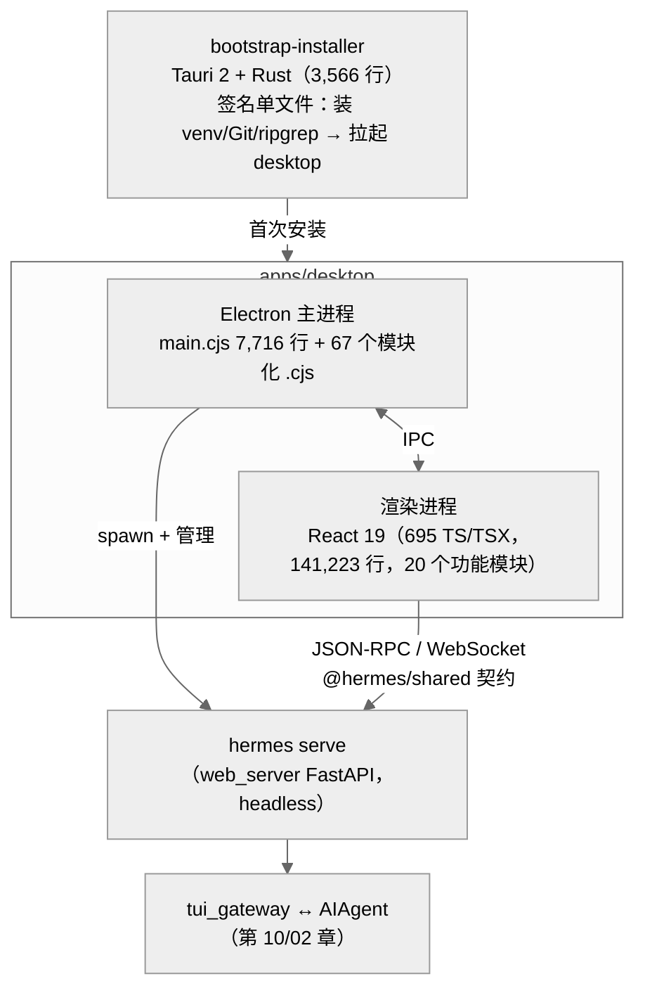

# 14-桌面应用：把 Agent 装进一个双击图标

中文 | [English](../en/14-desktop-app.md)

> **本章定位**：`apps/` 目录——`desktop/`（Electron + React 19 桌面客户端：695 个 TS/TSX，141,223 行 + 68 个 Electron 主进程 .cjs，17,543 行）、`bootstrap-installer/`（Tauri 2 + Rust 引导安装器：3,566 行 Rust + 1,264 行 TS）、`shared/`（526 行共享客户端库）。**分析层级为架构**：Electron 双进程、后端托管、JSON-RPC 契约、功能模块地图——不逐个深挖 React 组件。桌面与后端的对接机制（web_server/tui_gateway 的膨胀）见第 10 章。
> **关键文件**：`apps/desktop/electron/main.cjs`（7,716 行，主进程）、`apps/shared/src/json-rpc-gateway.ts`（事件契约）、`apps/desktop/electron/backend-command.cjs`（后端拉起策略）。

> **本章基于 hermes-agent v0.18.2（tag [`v2026.7.7.2`](https://github.com/NousResearch/hermes-agent/releases/tag/v2026.7.7.2)，commit `9de9c25f6`，2026-07-07）**

---

## 为什么要有桌面应用？

前面十四章里，Hermes 的所有入口都以终端为前提：CLI 要会开 shell，gateway 要会配 token，连 Web Dashboard 也得先 `hermes web`。对开发者这没问题；但"自改进的个人 AI 助手"的目标用户不该以会用终端为门槛。

`apps/desktop` 是 v0.17 起给出的答案：一个双击就能用的跨平台桌面应用（macOS DMG / Windows NSIS+MSI / Linux AppImage+deb+rpm 全平台分发）。它不是一个包着网页的壳——chat、会话管理、设置向导、技能市场、cron 面板、文件浏览器、语音、宠物（petdex）都是原生实现的 React 界面，14 万行 TypeScript 的完整应用。

但它对 Python 主体做到了**零侵入**：不 import 任何 Hermes 的 Python 代码，纯粹通过第 10 章的 web_server/tui_gateway API 对接——桌面应用本质上是这套 API 的第一个"大客户"，也是逼着 web_server 从 4,671 行长到 16,926 行的需求来源。

---

## 使用指南

### 安装与首次启动

从官网或 GitHub Releases 下载对应平台的安装包。Windows/macOS 用户拿到的是 **bootstrap 安装器**（Hermes-Setup）——一个带签名的单文件启动程序，双击后它负责：初始化 Python 虚拟环境、装好 Git/ripgrep 等依赖（内部驱动的就是 `install.ps1` 等官方安装脚本），然后拉起完整的桌面应用。之后的更新走应用内更新，不用重跑安装器。

首启后是图形化的 onboarding：选 Provider、登录（支持 Nous Portal OAuth 一键配齐）、选模型——等价于终端里的 `hermes setup`，但全程点选。

### 应用里有什么

- **Chat**——主界面。流式回复、思考块折叠、工具调用卡片、审批弹窗（危险命令的 once/session/always/deny 就在这里点）、模型切换器、状态栏（token 用量/费用）
- **会话与 Profile**——会话列表、搜索、分支；Profile 切换。**桌面和 CLI 共享同一个 `~/.hermes`**：桌面里开的会话，CLI 里 `/resume` 能接上，反之亦然
- **管理面板**——技能（浏览/安装，对接 04 章的多源 Hub）、插件启停（打的是 web_server 的插件管理 API）、cron 任务（可视化蓝图表单，对接 11 章）、gateway/消息平台状态
- **文件浏览器与内嵌终端**——右侧栏项目树（tui_gateway 的 git_probe/project_tree RPC，第 10 章）；内嵌 xterm.js 终端走 PTY WebSocket
- **语音**——按住说话（STT）与朗读回复（TTS），复用 10 章的语音管线

### 连接远程后端

桌面默认拉起本机后端，但也可以连远程机器上的 gateway（`设置 → Connection`）：远端跑 `hermes serve`/`hermes dashboard`，配好 dashboard 登录凭证（basic-auth 或 OAuth，对接 08 章的 dashboard_auth 插件），桌面填 URL 登录即可——"公司服务器跑 Agent、笔记本上开界面"。

### 排错指引

| 问题 | 排查方向 |
|------|---------|
| 启动后一直"connecting" | 后端冷启动可能要等（首启要编译整条 Python import 链，Windows 上 Defender 还会逐个扫 .pyc，30-60 秒属正常，`backend-ready.cjs` 注释）；看 `~/.hermes/logs/gui.log` |
| 桌面行为怪异/接口报错 | 桌面版本和后端版本不匹配——桌面独立发版（package.json v0.17.0），老后端可能缺新 API；升级 hermes 本体 |
| 想看桌面侧后端日志 | 四路日志的第四路：`~/.hermes/logs/gui.log`（web_server/pty_bridge/tui_gateway/uvicorn 都在这，第 13 章） |
| 卸载 | 应用内卸载或 `hermes desktop` CLI；卸载助手（`desktop-uninstall.cjs`）会清理托管的后端安装 |

> 📖 **延伸阅读（官方文档）：**
> - [Desktop App](https://hermes-agent.nousresearch.com/docs/user-guide/desktop)

---

## 架构与实现

### 三件套：desktop、bootstrap-installer、shared



**图：桌面三件套与 Python 后端的关系——安装器只跑一次，主进程管生命周期，渲染器走 API**

一个值得先记住的事实：**这三件东西用了三种技术栈**（Rust+Tauri / Node+Electron / TypeScript 库），却都不碰 Python——`apps/` 与主仓的耦合只有一条 HTTP/WebSocket API。桌面有独立版本号（0.17.0）和独立发行周期。

### 为什么安装器不用 Electron？

初看很怪：为了装一个 Electron 应用，先写一个 Tauri 应用。原因在安装器的特殊约束：它必须是**单文件、体积小、带系统签名**的可执行程序——用户从网页下载的第一个东西，SmartScreen/Gatekeeper 盯得最紧。Tauri 编译出的 Rust 二进制几 MB，Electron 起步就上百 MB。安装器只干三件事（`src-tauri/src/`：`bootstrap.rs`/`install_script.rs`/`powershell.rs`/`update.rs`）：检查/初始化 Python 环境、驱动官方安装脚本、把控制权交给桌面应用。`main.rs` 里连 `windows_subsystem = "windows"` 的位置都有注释记录教训——放错到 lib.rs 会让 Windows 上弹出一个多余的 cmd 黑窗。

### Electron 主进程：backend 保姆 + 67 个纯函数模块

`main.cjs`（7,716 行）是 Electron 侧的心脏，但这个"上帝文件"的周围是一圈**刻意与 Electron 解耦的纯函数模块**——`backend-command.cjs`、`backend-ready.cjs`、`backend-probes.cjs`、`connection-config.cjs`、`dashboard-token.cjs`、`bootstrap-runner.cjs`（739 行）……每个都自带 `node --test` 的同名测试文件（`*.test.cjs`），注释明说"kept standalone (no require('electron')) so it can be unit-tested"。主进程的可测试逻辑全部外置，`main.cjs` 只做胶水和 IPC 布线——这是对"Electron 主进程难以测试"这个行业通病的直接回答。

主进程对后端的管理是一条完整的生命周期：

1. **拉起**（`backend-command.cjs`）：spawn `hermes serve --host 127.0.0.1 --port 0`——`--port 0` 让 OS 分配随机端口，避免固定端口冲突。有一段防"升级半途变砖"的兼容逻辑：`serve` 是较新的子命令（注册于 `hermes_cli/subcommands/dashboard.py:137`），如果解析到的 hermes 运行时还不认识它（旧的托管安装、PATH 里的旧版本），就静态探测其源码后回退到等价的 `dashboard --no-open`
2. **等就绪**（`backend-ready.cjs`）：后端起来后向 stdout 喊一行 `HERMES_BACKEND_READY port=<N>`（旧版喊 `HERMES_DASHBOARD_READY`，两种都认），主进程据此拿到实际端口。就绪超时的设计考虑了真实世界：冷安装要编译整条 import 链、Windows Defender 实时扫描每个新 .pyc，pre-bind 开销可达 30-60 秒——超时窗口按此校准
3. **认证**（`dashboard-token.cjs`）：拿 web_server 的 ephemeral session token（第 10 章的安全模型），渲染器所有请求带 token
4. **收尾**（`desktop-uninstall.cjs`）：卸载时清理托管的后端安装

### JSON-RPC 契约：@hermes/shared

`apps/shared`（3 个文件，526 行）是桌面和 Web Dashboard 共用的客户端库，核心是 `JsonRpcGatewayClient`（`json-rpc-gateway.ts`）。它定义的 `GatewayEventName` 事件词表就是桌面与后端之间的**全部语言**：

```
gateway.ready · session.info
message.start / delta / complete
thinking.delta · reasoning.delta / available
status.update
tool.start / progress / complete / generating
clarify.request · approval.request · sudo.request · secret.request
background.complete · error · skin.changed
```

这套词表和前几章的机制一一对应：`message.delta` 是 02 章 `_fire_stream_delta` 的最终出口；`tool.*` 三件套对应 05 章 stream_events 的 ToolCallChunk；`clarify/approval/sudo/secret.request` 四个请求事件对应 01 章 callbacks.py 的三个回调加 sudo 门——桌面的审批弹窗就是这些事件的 UI 化；`skin.changed` 让皮肤在 CLI 里切、桌面同步变。连接状态机也在这层（`idle/connecting/open/closed/error`），断线重连由客户端库统一处理。

`websocket-url.ts` 处理两种远程认证模型的 URL 构造（token 直连 vs OAuth ticket 换票）——分类和强制规则在 Electron 侧的 `connection-config.cjs`（283 行 + 396 行测试，本地/远程/两种 auth 的规范化）。

### 20 个功能模块的地图

渲染器的 `src/app/` 按功能域拆成 20 个模块（TS/TSX 行数）：

| 模块 | 行数 | 内容 |
|------|------|------|
| chat | 20,943 | 主聊天：流式渲染、思考块、工具卡片、审批 UI |
| session | 9,641 | 会话列表/搜索/分支/恢复 |
| settings | 8,858 | 设置与 onboarding 向导 |
| right-sidebar | 5,503 | 右侧栏：项目树、git 状态（吃 tui_gateway 的 git_probe/project_tree RPC） |
| starmap | 3,817 | 会话星图可视化 |
| skills | 3,014 | 技能浏览/安装（对接多源 Hub，第 04 章） |
| shell | 2,942 | 内嵌终端（xterm.js ↔ PTY WebSocket） |
| command-palette / command-center | 1,319 / 1,094 | 命令面板 |
| profiles | 1,081 | Profile 切换 |
| artifacts | 1,046 | 产物预览 |
| pet-generate / pet-overlay | 993 / 494 | 桌面宠物（petdex，联动 04 章内置技能） |
| cron | 955 | 定时任务面板（蓝图表单，第 11 章） |
| messaging / gateway | 872 / 842 | 消息平台与 gateway 状态 |
| overlays / hooks / agents / learning | 725 / 453 / 390 / 74 | 浮层/共享 hooks/子代理视图/学习面板 |

选材立场重申：这张表是**地图不是导游**——每个模块内部的 React 组件结构不在本章（也不在本系列）范围内。值得记的是分布形态：chat 一家占渲染器代码的近 15%，与"聊天是桌面应用的主战场"一致；而 cron/skills/plugins 这些管理面板都很薄——重活全在 Python 侧的 API 里，前端只是表单。

### 设计决策

#### 完整应用，而非 Web 壳

桌面应用最省事的做法是 Electron 包一层 Web Dashboard 完事。Hermes 选择了重写原生 React 界面、只复用 API。代价是 14 万行前端代码；换来的是桌面级体验（宠物浮层、命令面板、系统托盘、PTY 终端）和与 Web Dashboard 各自演化的自由。`@hermes/shared` 是两者共享的最大公约数——契约共享，界面分道。

#### 对 Python 零侵入

桌面对主仓的全部依赖是一条 HTTP/WebSocket API 加一个 stdout 就绪握手。没有任何 Python 代码知道"桌面"的存在（`HERMES_DESKTOP=1` 只是 web_server 的一个行为开关）。这让桌面可以独立发版（0.17.0 的桌面配 0.18.2 的后端），也让后端 API 被迫保持向后兼容——`serve`/`dashboard --no-open` 的双轨兼容就是这个约束的产物。

#### 主进程逻辑纯函数化

Electron 主进程代码难测试是行业通病（依赖 electron 运行时、涉及窗口/IPC）。desktop 的解法是把所有可纯化的逻辑抽成无 electron 依赖的 .cjs 模块 + node --test 测试（67 个模块文件里测试文件几乎一比一），`main.cjs` 只留胶水。7,716 行的主文件依然庞大，但它的每一块可测逻辑都住在有测试的模块里——和 Python 侧 god-file 分解（第 00 章）异曲同工。

### 扩展点

1. **远程后端**：任何跑着 `hermes serve` 的机器都能当桌面的后端
2. **认证方案**：dashboard_auth 插件（第 08 章）扩展登录方式
3. **共享客户端库**：`@hermes/shared` 可被第三方前端复用——事件词表就是公开契约

---

## 与其他章节的关系

| 关联章节 | 关系 |
|---------|------|
| 00 — 项目全景 | apps/ 是代码库的第七个区域 |
| 01 — 基础设施层 | 共享 HERMES_HOME；Profile 体系直接可用 |
| 02 — Agent 核心 | message/tool/approval 事件的最终生产者 |
| 08 — 内置插件 | dashboard_auth 提供远程登录方案 |
| 10 — 交互界面 | web_server/tui_gateway 是桌面的后端（对接机制详述于彼） |
| 11 — Cron 调度 | 桌面内嵌 cron ticker，无 gateway 也能准点触发 |
| 13 — 工程实践 | gui.log 是桌面侧的日志归宿 |

---

*本文基于 hermes-agent v0.18.2 源码分析。所有代码引用均经过独立验证。*
